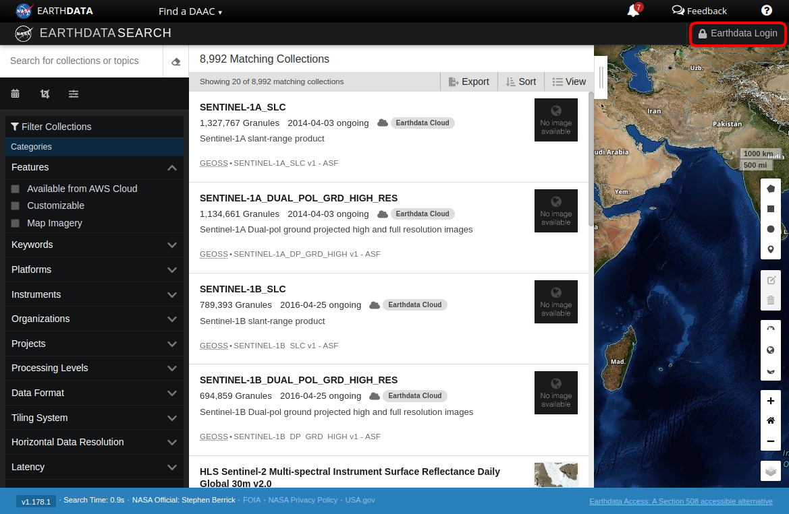
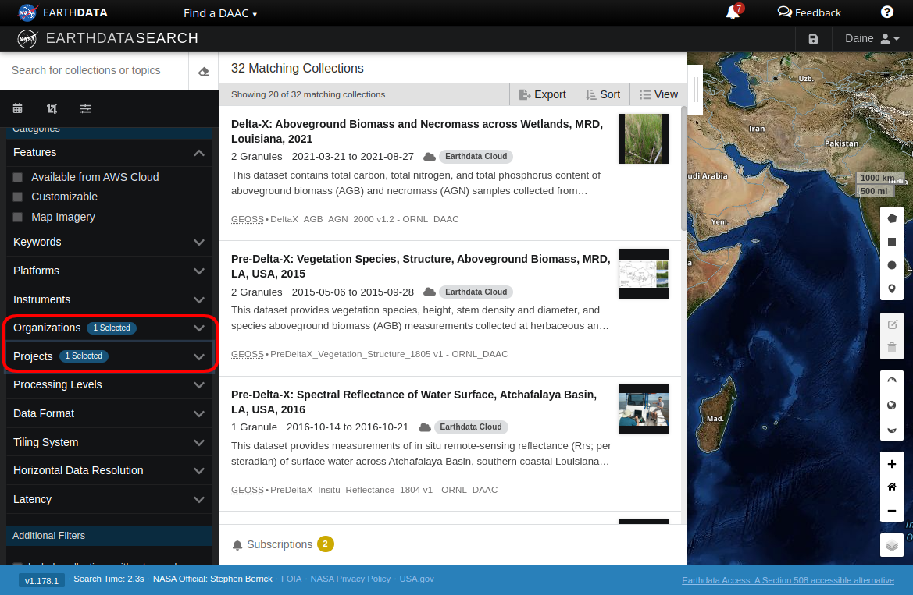
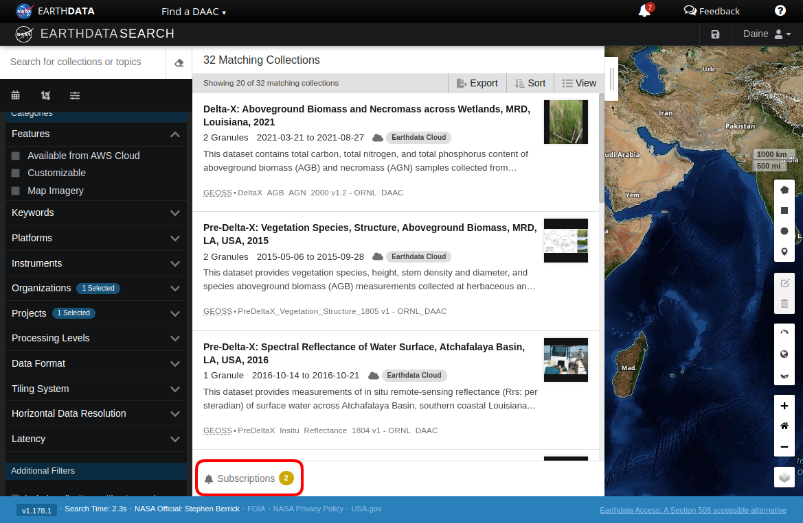
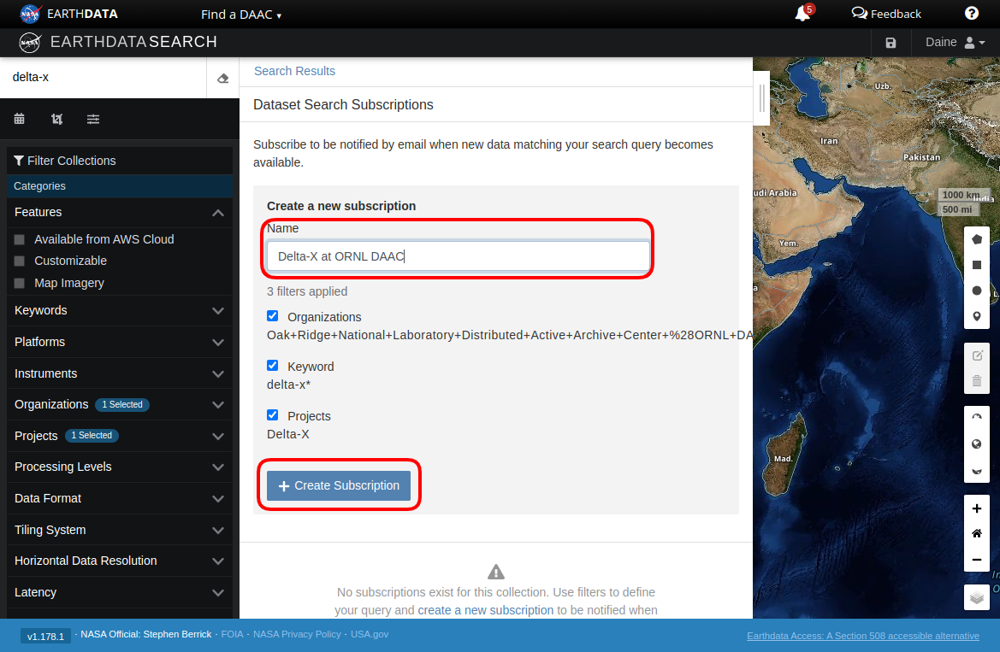
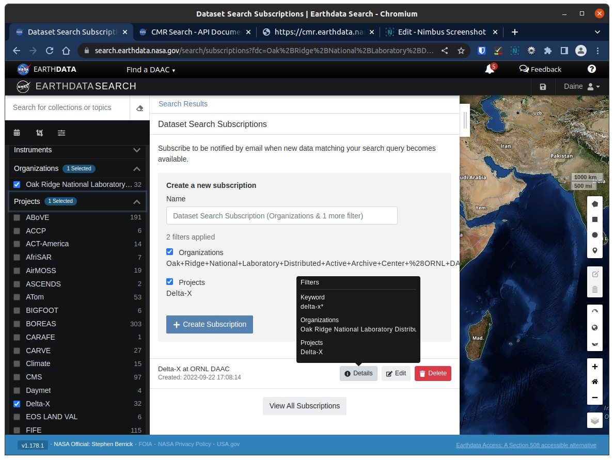
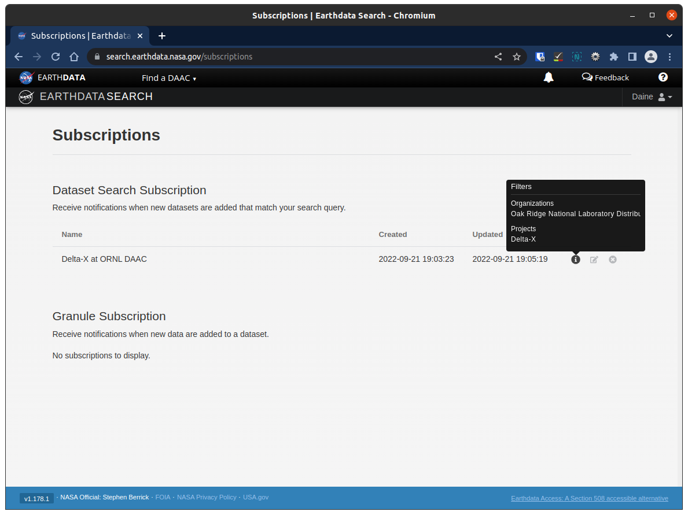

# How To: Create a Subscription in Earthdata Search

Author: ORNL DAAC
Date: September 22, 2022
Contact for the ORNL DAAC: uso@daac.ornl.gov

Keywords: search, subscriptions, Earthdata Search

## Overview

Earthdata Search provides to ability for a logged in user to create subscriptions based on search criteria. Here are the steps to create a dataset subscription. Granule subscriptions are also possible, but are beyond the scope of this How To, at the time of writing.

## Steps

1. Log in to Earthdata Search

    

2. Enter your search terms. In this case we will selected for `project = delta-x` and `organization = ORNL DAAC` in the facet dropdown menus. Other facets and search terms can be included.

    

3. Click the Subscriptions link at the bottom of the search results list of collections.

    This will open the Dataset Search Subscriptions widget.

    

4. Add subscription

    Give the subscription a memorable name like "Delta-X at ORNL DAAC".

    Verify your filters match what you expect. If not you can uncheck filters here or go back to the search interface to update the filters.

    Click "Create Subscription".

    

    A confirmation pop up will appear and disappear quickly in the upper right hand corner of the Earthdata Search interface.

5. Verify subscriptions

    After creating a subscription, you will be returned to the Dataset Search Subscriptions widget with your previous search terms. There will be a warning stating you already have a matching subscription.

    To verify your subscription, see the list at the bottom of the widget. You should see your memorable name, in this example we used "Delta-X at ORNL DAAC". Hover over "Details" to see the filters.

    

    A similar view of subscriptions can be found by clicking "View All Subscriptions" just below the list. See the screenshot in the "Understand what the email is telling you" section below.

6. Receive email when new collections are published

    When a new collection is published to CMR by ORNL DAAC, you will receive an email to your Earthdata Login registered email address. The email looks like this:

    
    > SUBJECT: Email Subscription Notification  
    > FROM: cmr-support@earthdata.nasa.gov
    >
    > You have subscribed to receive notifications when new collections are added that match the following search query:
    >
    > `has_granules_or_cwic=true&data_center_h[]=Oak Ridge National Laboratory Distributed Active Archive Center (ORNL DAAC)`
    >
    > Running the query with a time window from 2022-09-17T01:28:41.107Z to 2022-09-21T13:28:35.203Z, the following collections have been added or updated:
    >
    > https://cmr.earthdata.nasa.gov:443/search/concepts/C2473044511-ORNL_DAAC/1  
    > To unsubscribe from these notifications, or if you have any questions, please contact us at cmr-support@earthdata.nasa.gov.

    Note: This is for a subscription to the ORNL DAAC data center only.
    
7. Understand what the email is telling you

    This is a confusing email unless you are versed in CMR concept IDs.

    The query is the CMR query used for this subscription. A human readable version of this can be found on your [Subscriptions](https://search.earthdata.nasa.gov/subscriptions) page. Hover over the information icon to see the filter for a subscription. Note this is the slightly different view of 

    

    In this example, `has_granules_or_cwic=true&data_center_h[]=Oak Ridge National Laboratory Distributed Active Archive Center (ORNL DAAC)&project[]=Delta-X` means "filter Delta-X collections at ORNL DAAC that have granules".

    The time window tells you when the collections were added. I think the second datetime is close to the publication of the new collection(s).

    The link is to the CMR dataset landing page. The title of the dataset and it metadata can be seen on this page. To reach the ORNL DAAC dataset landing page, click the "Citation Info" tab. From there copy the DOI and paste it into the browser address bar.
